# Canvas 七层叠加渲染管线数据流图

## 1. 概述

本文档深入解析手写字模拟器项目中的 Canvas 七层叠加渲染机制。渲染引擎采用**自底向上**的分层叠加策略，通过单一 Canvas 2D 上下文逐层绘制，最终合成完整的手写效果页面。

**核心渲染入口**：[useHandwritingRender.ts](file:///Volumes/ExMac/traeProject/0617GSB/yq-33/yq-33-617_Saturn/src/hooks/useHandwritingRender.ts) 中的 `renderToCanvas` 函数（第611-658行）

---

## 2. 七层渲染管线总览

### 2.1 层级结构图（从下到上）

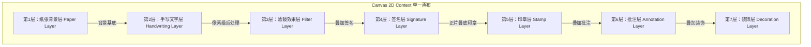

### 2.2 渲染执行顺序表

| 层级 | 层名称 | 绘制函数 | 核心文件 | 绘制时机 | 混合模式 |
|------|--------|----------|----------|----------|----------|
| 1 | 纸张背景层 | `drawPaper()` | [useHandwritingRender.ts](file:///Volumes/ExMac/traeProject/0617GSB/yq-33/yq-33-617_Saturn/src/hooks/useHandwritingRender.ts#L63-L157) | 最先绘制 | source-over |
| 2 | 手写文字层 | `drawHandwrittenPage()` / `drawMarkdownPage()` | [useHandwritingRender.ts](file:///Volumes/ExMac/traeProject/0617GSB/yq-33/yq-33-617_Saturn/src/hooks/useHandwritingRender.ts#L245-L398) / [markdownRenderer.ts](file:///Volumes/ExMac/traeProject/0617GSB/yq-33/yq-33-617_Saturn/src/utils/markdown/markdownRenderer.ts) | 纸张之上 | source-over |
| 3 | 滤镜效果层 | `applyFilter()` | [filterEffects.ts](file:///Volumes/ExMac/traeProject/0617GSB/yq-33/yq-33-617_Saturn/src/utils/filterEffects.ts) | 文字层之后（像素级处理） | 直接修改 ImageData |
| 4 | 签名层 | `drawSignaturesForPage()` | [signatureRenderer.ts](file:///Volumes/ExMac/traeProject/0617GSB/yq-33/yq-33-617_Saturn/src/utils/signatureRenderer.ts) | 滤镜之后 | source-over |
| 5 | 印章层 | `drawStampsForPage()` | [stampRenderer.ts](file:///Volumes/ExMac/traeProject/0617GSB/yq-33/yq-33-617_Saturn/src/utils/stampRenderer.ts) | 签名之上 | multiply（正片叠底） |
| 6 | 批注层 | `drawAnnotationsForPage()` | [annotationRenderer.ts](file:///Volumes/ExMac/traeProject/0617GSB/yq-33/yq-33-617_Saturn/src/utils/annotationRenderer.ts) | 印章之上 | source-over |
| 7 | 装饰层 | `drawDecorationsForPage()` | [decorationRenderer.ts](file:///Volumes/ExMac/traeProject/0617GSB/yq-33/yq-33-617_Saturn/src/utils/decorationRenderer.ts) | 最后绘制 | source-over |

---

## 3. 渲染管线数据流图

### 3.1 完整数据流图

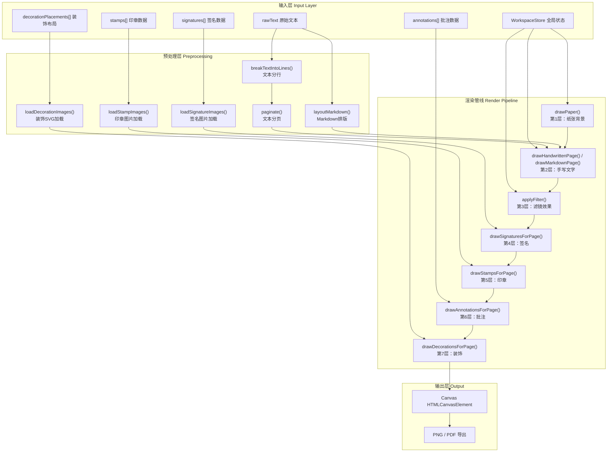

---

## 4. 各层详细解析

### 4.1 第1层：纸张背景层 (Paper Layer)

**核心函数**：[drawPaper()](file:///Volumes/ExMac/traeProject/0617GSB/yq-33/yq-33-617_Saturn/src/hooks/useHandwritingRender.ts#L63-L157)

**职责**：构建页面最底层的纸张视觉效果

**绘制子流程**：

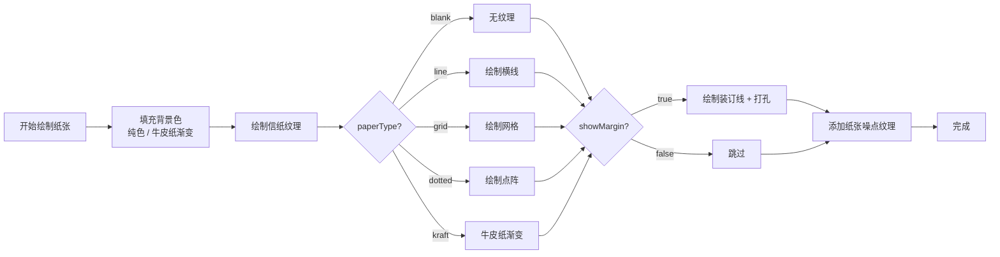

**关键技术点**：
- 牛皮纸效果使用 `createLinearGradient` 创建多色渐变
- 横线/网格/点阵使用 `stroke()` 和 `arc()` 逐点绘制
- 装订线包含红色竖线 + 三个圆形打孔（白色填充 + 浅棕描边）
- 最后叠加一层半透明渐变噪点模拟纸张质感
- 所有坐标基于 `marginTop/marginBottom/marginLeft/marginRight` 计算

---

### 4.2 第2层：手写文字层 (Handwriting Layer)

**核心函数**：[drawHandwrittenPage()](file:///Volumes/ExMac/traeProject/0617GSB/yq-33/yq-33-617_Saturn/src/hooks/useHandwritingRender.ts#L245-L398)

**职责**：在纸张背景上逐字绘制带有手写抖动效果的文字

**绘制子流程**：

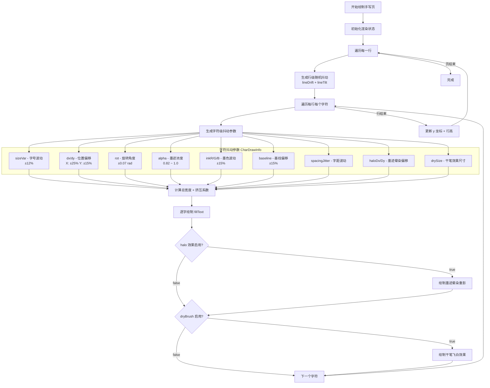

**关键技术点**：
- 使用 `seededRandom()` 种子随机数确保同一页每次渲染结果一致
- 每个字符独立变换：`translate → rotate → fillText`
- 支持 Markdown 模式，通过 `drawMarkdownPage()` 实现富文本排版
- 文字超宽时自动 `squeeze` 压缩字间距
- 支持 **halo（墨迹晕染）** 和 **dryBrush（干笔飞白）** 两种高级效果

---

### 4.3 第3层：滤镜效果层 (Filter Layer)

**核心函数**：[applyFilter()](file:///Volumes/ExMac/traeProject/0617GSB/yq-33/yq-33-617_Saturn/src/utils/filterEffects.ts#L4-L49)

**职责**：对前两层合成结果进行像素级后处理，模拟不同书写工具效果

**处理方式**：`getImageData() → 像素操作 → putImageData()`

**滤镜类型与数据流**：

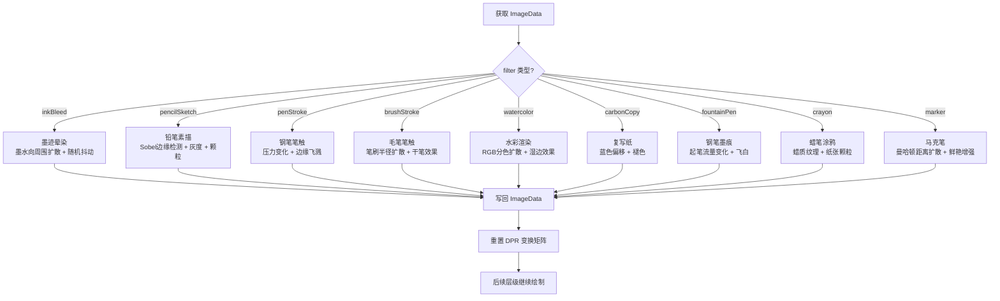

**关键技术点**：
- 所有滤镜操作在**像素级别**完成，直接修改 `Uint8ClampedArray`
- 通过 `isInkPixel()` 判断墨迹像素（基于颜色距离阈值）
- 滤镜强度 `intensity` 参数控制效果程度（0~1）
- 滤镜应用后需调用 `ctx.setTransform(DPR, 0, 0, DPR, 0, 0)` 重置变换矩阵
- **重要**：滤镜只作用于第1、2层，第4-7层不受滤镜影响

---

### 4.4 第4层：签名层 (Signature Layer)

**核心函数**：[drawSignaturesForPage()](file:///Volumes/ExMac/traeProject/0617GSB/yq-33/yq-33-617_Saturn/src/utils/signatureRenderer.ts#L167-L187)

**职责**：在页面指定位置放置手写签名图片

**绘制流程**：

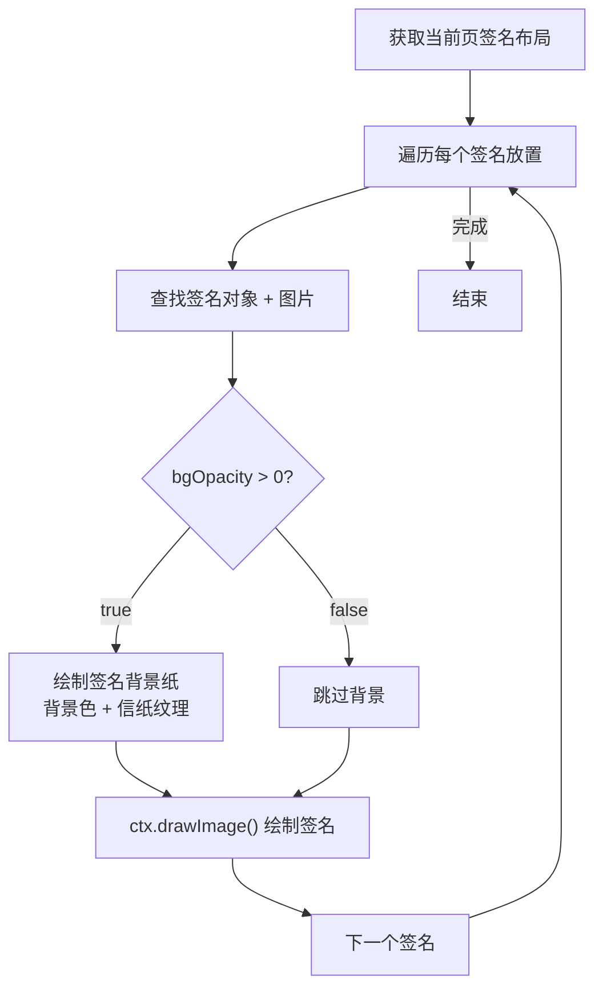

**关键技术点**：
- 签名图片预加载并存入 `signatureImages` 状态缓存
- 支持自定义背景纸（与第1层纸张效果一致）
- 放置位置基于中心点坐标 `(x, y)` + `scale` 缩放
- 使用 `drawImage()` 直接绘制，支持透明背景
- 每个签名关联 `pageIndex`，只在对应页绘制

---

### 4.5 第5层：印章层 (Stamp Layer)

**核心函数**：[drawStampsForPage()](file:///Volumes/ExMac/traeProject/0617GSB/yq-33/yq-33-617_Saturn/src/utils/stampRenderer.ts#L416-L436)

**职责**：在页面上以正片叠底模式叠加印章效果

**绘制流程**：

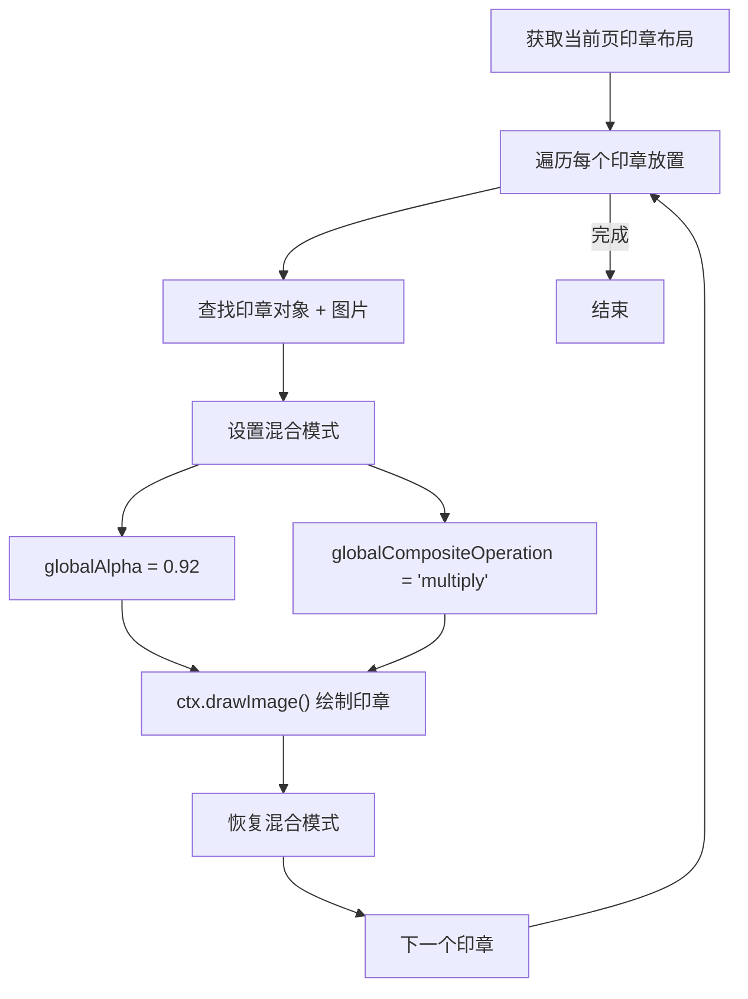

**印章内部结构（渲染时）**：

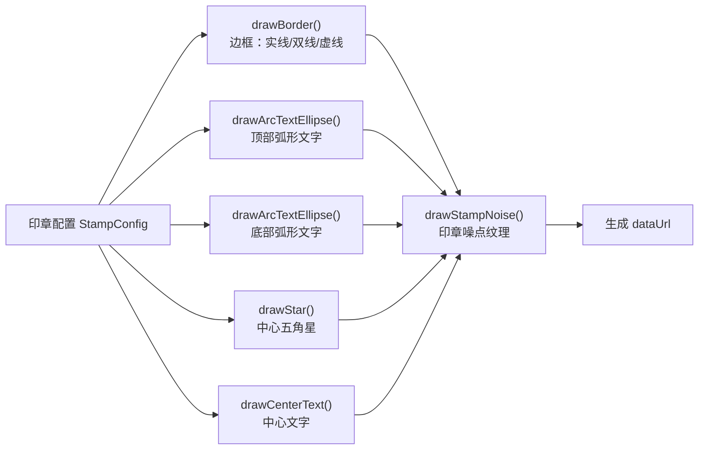

**关键技术点**：
- 使用 `globalCompositeOperation = 'multiply'` 正片叠底模拟真实印章盖印效果
- `globalAlpha = 0.92` 模拟印泥不饱满的真实感
- 印章渲染时内置噪点纹理（缺墨、斑驳效果）
- 支持圆形、方形、椭圆形三种印章形状
- 支持顶部弧形文字、底部弧形文字、中心五角星、中心文字等元素
- 印章图片预生成并缓存为 DataURL

---

### 4.6 第6层：批注层 (Annotation Layer)

**核心函数**：[drawAnnotationsForPage()](file:///Volumes/ExMac/traeProject/0617GSB/yq-33/yq-33-617_Saturn/src/utils/annotationRenderer.ts#L162-L169)

**职责**：在页面上绘制各类批注标记（笔迹、图形、文字等）

**批注类型与绘制方法**：

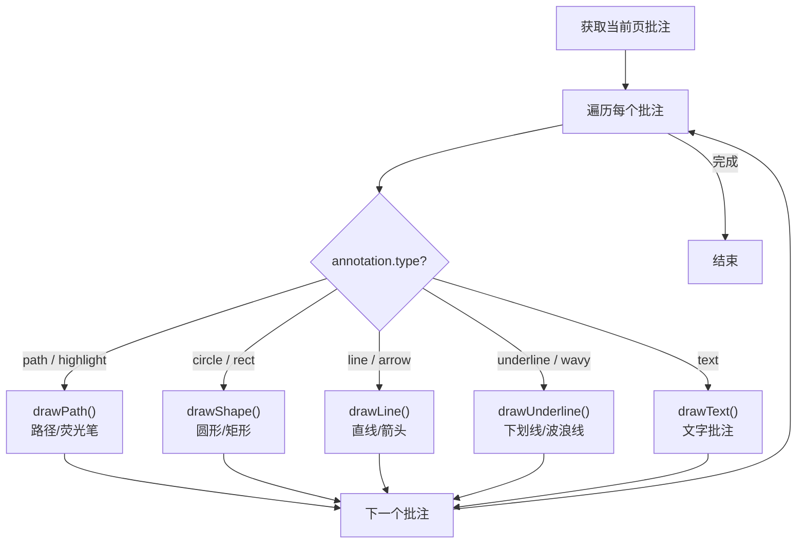

**关键技术点**：
- 每种批注类型独立绘制函数，统一通过 `drawAnnotation()` 分发
- 样式统一通过 `applyStyle()` 设置：颜色、线宽、透明度、lineCap、lineJoin
- 荧光笔使用 `path` 类型 + 半透明颜色模拟
- 箭头使用 `Math.atan2()` 计算角度 + 三角形填充
- 波浪线使用 `quadraticCurveTo()` 绘制正弦曲线
- 所有批注关联 `pageIndex`，支持多页批注

---

### 4.7 第7层：装饰层 (Decoration Layer)

**核心函数**：[drawDecorationsForPage()](file:///Volumes/ExMac/traeProject/0617GSB/yq-33/yq-33-617_Saturn/src/utils/decorationRenderer.ts#L61-L106)

**职责**：在页面最顶层添加装饰元素（胶带、贴纸、花朵等）

**绘制流程**：

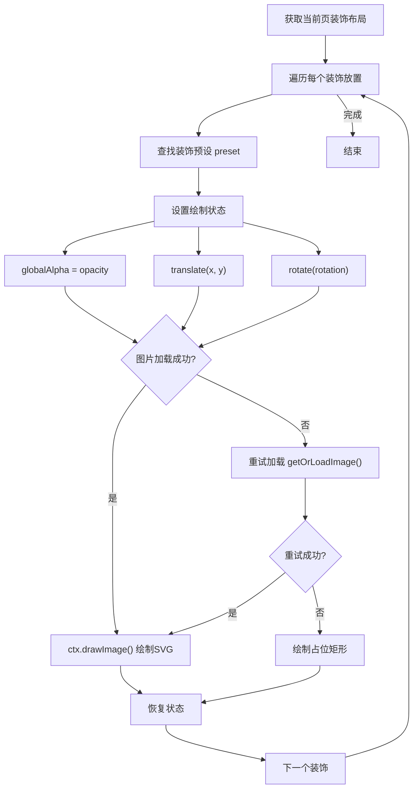

**装饰分类**：

| 类别 | 说明 | 示例 |
|------|------|------|
| tape | 胶带 | 透明胶带、纸胶带 |
| sticker | 贴纸 | 卡通贴纸、标签贴纸 |
| flower | 花朵 | 干花、植物装饰 |
| stamp | 邮戳 | 复古邮戳、纪念章 |
| corner | 角贴 | 照片角贴、装饰角 |
| ribbon | 丝带 | 缎带、蝴蝶结 |

**关键技术点**：
- 装饰元素以 SVG 格式存储，通过 `Blob + URL.createObjectURL` 转成图片绘制
- 支持三级降级：缓存图片 → 重试加载 → 占位矩形
- 每个装饰独立变换：`translate → rotate → drawImage`
- 支持透明度 `opacity` 和旋转角度 `rotation`
- 装饰放置数据包含：位置、尺寸、旋转、透明度、关联页面

---

## 5. 核心渲染函数调用链

### 5.1 renderToCanvas 调用链

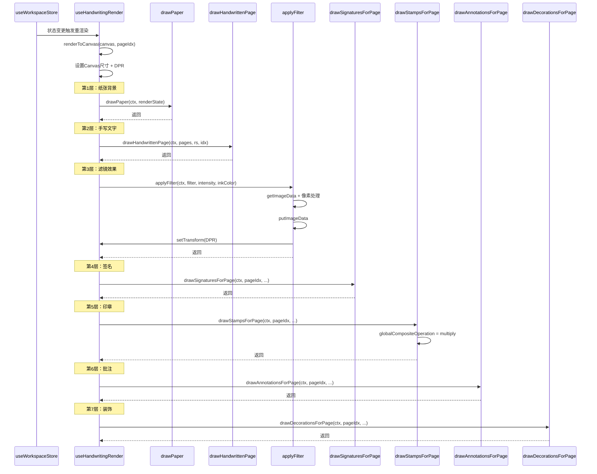

---

## 6. 状态驱动与响应式渲染

### 6.1 状态依赖关系图

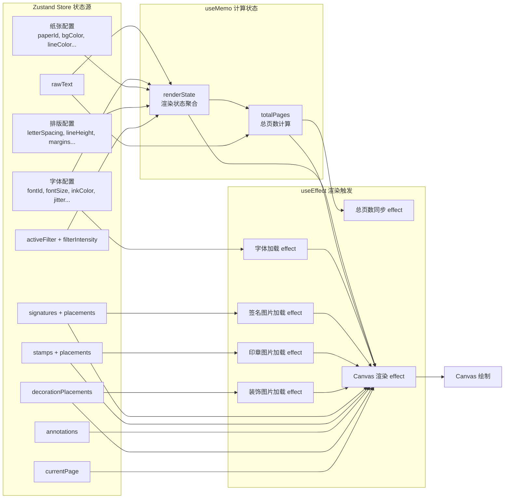

### 6.2 性能优化策略

| 优化手段 | 实现位置 | 说明 |
|----------|----------|------|
| `useMemo` 缓存渲染状态 | [useHandwritingRender.ts:442](file:///Volumes/ExMac/traeProject/0617GSB/yq-33/yq-33-617_Saturn/src/hooks/useHandwritingRender.ts#L442-L487) | 避免重复构建 renderState |
| `useCallback` 缓存绘制函数 | 多处 | 减少函数重建 |
| 图片预加载缓存 | signatureImages / stampImages / decorationImages | 避免重复加载图片 |
| 种子随机数 | `seededRandom()` | 同页渲染结果一致，减少重绘差异 |
| DPR 预计算 | `ctx.setTransform(DPR, 0, 0, DPR, 0, 0)` | 一次性设置像素比，避免逐点计算 |
| 只渲染当前页 | `renderToCanvas(canvas, currentPage - 1)` | 不渲染不可见页面 |

---

## 7. 导出管线（全页渲染）

### 7.1 renderAllCanvases 多页导出流程

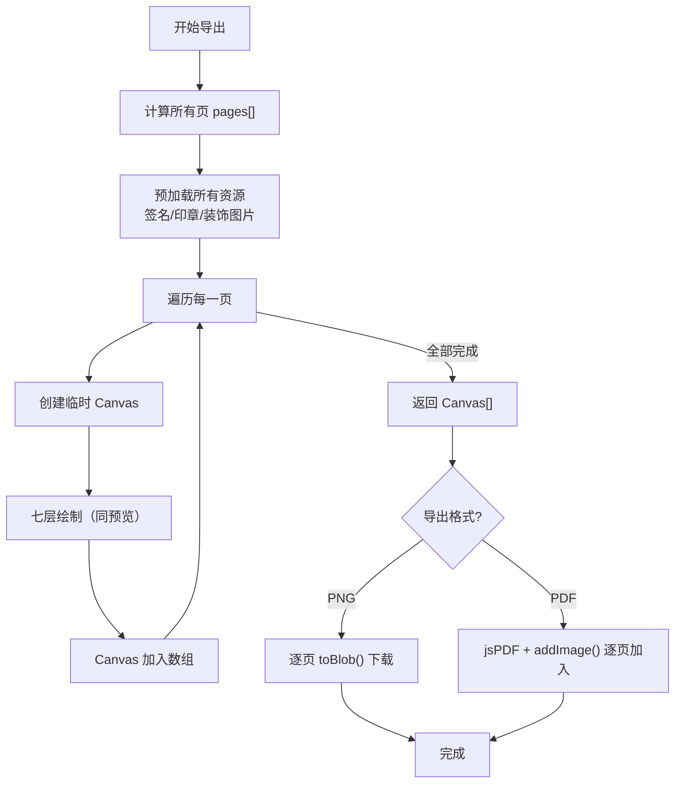

**核心函数**：[renderAllCanvases()](file:///Volumes/ExMac/traeProject/0617GSB/yq-33/yq-33-617_Saturn/src/hooks/useHandwritingRender.ts#L660-L734)

---

## 8. 总结

### 8.1 设计亮点

1. **分层清晰**：七层各司其职，从背景到前景逻辑分明
2. **像素级控制**：滤镜层直接操作 ImageData，效果丰富
3. **状态驱动**：Zustand + useMemo + useEffect 响应式渲染
4. **性能优化**：资源缓存、按需渲染、种子随机数
5. **可扩展性**：各层独立模块，新增效果不影响其他层
6. **单一 Canvas**：使用单一画布 + 分层绘制，避免多 Canvas 合成开销

### 8.2 关键文件索引

| 模块 | 文件路径 | 核心功能 |
|------|----------|----------|
| 渲染主 Hook | [useHandwritingRender.ts](file:///Volumes/ExMac/traeProject/0617GSB/yq-33/yq-33-617_Saturn/src/hooks/useHandwritingRender.ts) | 七层渲染调度核心 |
| 纸张绘制 | 同上 drawPaper() | 第1层：纸张背景 |
| 手写文字绘制 | 同上 drawHandwrittenPage() | 第2层：手写文字 |
| 滤镜效果 | [filterEffects.ts](file:///Volumes/ExMac/traeProject/0617GSB/yq-33/yq-33-617_Saturn/src/utils/filterEffects.ts) | 第3层：9种滤镜效果 |
| 签名渲染 | [signatureRenderer.ts](file:///Volumes/ExMac/traeProject/0617GSB/yq-33/yq-33-617_Saturn/src/utils/signatureRenderer.ts) | 第4层：签名叠加 |
| 印章渲染 | [stampRenderer.ts](file:///Volumes/ExMac/traeProject/0617GSB/yq-33/yq-33-617_Saturn/src/utils/stampRenderer.ts) | 第5层：印章叠加 |
| 批注渲染 | [annotationRenderer.ts](file:///Volumes/ExMac/traeProject/0617GSB/yq-33/yq-33-617_Saturn/src/utils/annotationRenderer.ts) | 第6层：批注绘制 |
| 装饰渲染 | [decorationRenderer.ts](file:///Volumes/ExMac/traeProject/0617GSB/yq-33/yq-33-617_Saturn/src/utils/decorationRenderer.ts) | 第7层：装饰叠加 |
| Canvas 工具 | [canvasUtils.ts](file:///Volumes/ExMac/traeProject/0617GSB/yq-33/yq-33-617_Saturn/src/utils/canvasUtils.ts) | 种子随机数、颜色转换等 |
| 状态管理 | [useWorkspaceStore.ts](file:///Volumes/ExMac/traeProject/0617GSB/yq-33/yq-33-617_Saturn/src/store/useWorkspaceStore.ts) | 全局状态管理 |
| Markdown 渲染 | [markdownRenderer.ts](file:///Volumes/ExMac/traeProject/0617GSB/yq-33/yq-33-617_Saturn/src/utils/markdown/markdownRenderer.ts) | 第2层 Markdown 模式 |
