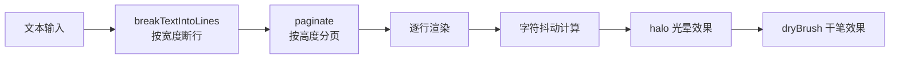
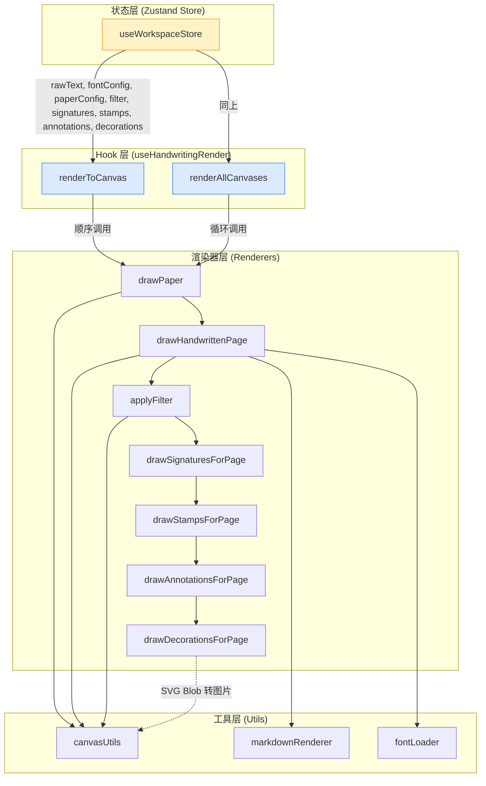

# Canvas 七层叠加渲染机制深度解析

## 一、概述

本项目是一个手写字模拟器，采用 **Canvas 2D API** 实现了七层叠加渲染管线。整个渲染流程在单一 Canvas 上按顺序分层绘制，通过 `globalAlpha`、`globalCompositeOperation`、`setTransform` 等 Canvas API 实现图层混合效果。

**核心渲染入口**: [useHandwritingRender.ts](file:///Volumes/ExMac/traeProject/0617GSB/yq-33/yq-33-617_Jupiter/src/hooks/useHandwritingRender.ts#L611-L658) 中的 `renderToCanvas` 函数

---

## 二、七层渲染管线数据流图

```mermaid
flowchart TD
    subgraph "输入数据源"
        A[rawText 原始文本]
        B[paperConfig 纸张配置]
        C[fontConfig 字体配置]
        D[filterConfig 滤镜配置]
        E[signatures 签名数据]
        F[stamps 印章数据]
        G[annotations 批注数据]
        H[decorations 装饰数据]
    end

    subgraph "Canvas 渲染管线 (自上而下)"
        L1[第1层: 纸张背景层<br/>drawPaper()]
        L2[第2层: 手写文字层<br/>drawHandwrittenPage() / drawMarkdownPage()]
        L3[第3层: 滤镜效果层<br/>applyFilter()]
        L4[第4层: 签名层<br/>drawSignaturesForPage()]
        L5[第5层: 印章层<br/>drawStampsForPage()]
        L6[第6层: 批注层<br/>drawAnnotationsForPage()]
        L7[第7层: 装饰层<br/>drawDecorationsForPage()]
    end

    subgraph "输出结果"
        OUT[最终 Canvas 图像<br/>794 × 1123 px @ DPR=2]
    end

    B --> L1
    A --> L2
    C --> L2
    D --> L3
    E --> L4
    F --> L5
    G --> L6
    H --> L7

    L1 --> L2
    L2 --> L3
    L3 --> L4
    L4 --> L5
    L5 --> L6
    L6 --> L7
    L7 --> OUT

    style L1 fill:#fef3c7,stroke:#f59e0b,color:#92400e
    style L2 fill:#dbeafe,stroke:#3b82f6,color:#1e40af
    style L3 fill:#e9d5ff,stroke:#8b5cf6,color:#5b21b6
    style L4 fill:#d1fae5,stroke:#10b981,color:#065f46
    style L5 fill:#fee2e2,stroke:#ef4444,color:#991b1b
    style L6 fill:#fce7f3,stroke:#ec4899,color:#9d174d
    style L7 fill:#f3e8ff,stroke:#a855f7,color:#6b21a8
```

---

## 三、渲染顺序与层级关系

| 层级 | 层名称 | 渲染函数 | 混合模式 | 关键特性 |
|------|--------|----------|----------|----------|
| 1 | 纸张背景层 | `drawPaper()` | source-over | 底色、线条/网格、装订线、打孔 |
| 2 | 手写文字层 | `drawHandwrittenPage()` | source-over | 抖动算法、Markdown 排版 |
| 3 | 滤镜效果层 | `applyFilter()` | 像素级处理 | 墨水晕染/铅笔/钢笔/水彩等 9 种滤镜 |
| 4 | 签名层 | `drawSignaturesForPage()` | source-over | 透明背景签名图片叠加 |
| 5 | 印章层 | `drawStampsForPage()` | **multiply** | 正片叠底，模拟真实印章效果 |
| 6 | 批注层 | `drawAnnotationsForPage()` | source-over | 自由路径、形状、文字、下划线 |
| 7 | 装饰层 | `drawDecorationsForPage()` | source-over | SVG 装饰元素，支持透明度和旋转 |

> **设计原则**: 滤镜层位于文字层之后、签名/印章/批注/装饰层之前，确保滤镜只作用于纸张和文字，不影响上层叠加元素。

---

## 四、各层详细解析

### 第 1 层：纸张背景层 (Paper Layer)

**核心函数**: [drawPaper()](file:///Volumes/ExMac/traeProject/0617GSB/yq-33/yq-33-617_Jupiter/src/hooks/useHandwritingRender.ts#L63-L157)

**功能组成**:
- **背景填充**: 纯色填充或牛皮纸渐变（Kraft 类型）
- **纸张纹理**: 线性渐变叠加的噪点质感
- **辅助线**: 
  - `line` - 横线
  - `grid` - 网格线
  - `dotted` - 点阵
  - `blank` - 空白
- **装订线**: 左侧红色竖线 + 三个打孔圆环
- **噪声叠加**: 轻微的棕褐色渐变，模拟纸张质感

**关键参数**:
```typescript
interface PaperConfig {
  type: 'line' | 'grid' | 'dotted' | 'blank' | 'kraft'
  bgColor: string          // 背景色
  lineColor: string        // 线条颜色
  lineSpacing: number      // 线间距
  showMargin: boolean      // 显示装订线
  hasMargin?: boolean      // 是否有装订线
}
```

---

### 第 2 层：手写文字层 (Text Layer)

**核心函数**: [drawHandwrittenPage()](file:///Volumes/ExMac/traeProject/0617GSB/yq-33/yq-33-617_Jupiter/src/hooks/useHandwritingRender.ts#L245-L398)

**渲染流程**:



**核心抖动参数 (JitterParams)**:

| 参数 | 作用 | 效果 |
|------|------|------|
| `positionX` / `positionY` | 字符位置偏移 | 模拟手写不规整 |
| `size` | 字号随机变化 | 笔画粗细不一 |
| `rotation` | 字符旋转 | 手写倾斜感 |
| `baseline` | 基线偏移 | 上下浮动 |
| `inkDensity` | 墨色浓度 | 透明度随机变化 |
| `inkColor` | 墨色变化 | RGB 通道微调 |
| `spacing` | 字间距抖动 | 松紧不一 |
| `lineDrift` / `lineTilt` | 行漂移/行倾斜 | 整行上下波动、倾斜 |
| `halo` | 光晕效果 | 墨水扩散边缘 |
| `dryBrush` | 干笔效果 | 飞白/断墨 |

**Markdown 支持**: 当 `markdownEnabled` 为 true 时，使用 [drawMarkdownPage()](file:///Volumes/ExMac/traeProject/0617GSB/yq-33/yq-33-617_Jupiter/src/utils/markdown/markdownRenderer.ts) 进行富文本排版。

---

### 第 3 层：滤镜效果层 (Filter Layer)

**核心函数**: [applyFilter()](file:///Volumes/ExMac/traeProject/0617GSB/yq-33/yq-33-617_Jupiter/src/utils/filterEffects.ts#L4-L49)

**工作原理**: 通过 `getImageData()` 获取像素数据，进行像素级运算后 `putImageData()` 写回。

**支持的滤镜类型**:

| 滤镜 | 算法 | 效果描述 |
|------|------|----------|
| `inkBleed` | 墨水扩散算法 | 墨水晕染、渗透效果 |
| `pencilSketch` | Sobel 边缘检测 | 铅笔素描质感 |
| `penStroke` | 压力随机 + 边缘羽化 | 钢笔笔触 |
| `brushStroke` | 毛笔笔锋算法 | 毛笔笔触 |
| `watercolor` | 三色通道分离扩散 | 水彩渲染 |
| `carbonCopy` | 蓝色色偏 + 颗粒感 | 复写纸效果 |
| `fountainPen` | 出水流量变化 + 飞白 | 钢笔效果 |
| `crayon` | 蜡笔纹理 + 颗粒感 | 蜡笔效果 |
| `marker` | 马克笔晕染 + 饱和度提升 | 马克笔效果 |

> **注意**: 滤镜应用后会重置 transform 矩阵（`ctx.setTransform(DPR, 0, 0, DPR, 0, 0)`），确保后续层渲染坐标正确。

---

### 第 4 层：签名层 (Signature Layer)

**核心函数**: [drawSignaturesForPage()](file:///Volumes/ExMac/traeProject/0617GSB/yq-33/yq-33-617_Jupiter/src/utils/signatureRenderer.ts#L167-L187)

**渲染逻辑**:
1. 筛选当前页的签名放置位置 `signaturePlacements`
2. 根据 `signatureId` 查找签名数据和预加载的图片
3. 按缩放比例计算绘制尺寸，居中对齐放置点
4. 可选：绘制签名背景（当 `bgOpacity > 0` 时）

**签名数据结构**:
```typescript
interface Signature {
  id: string
  dataUrl: string       // 签名图片 base64
  width: number         // 原始宽度
  height: number        // 原始高度
  bgOpacity?: number    // 背景不透明度
  paperType?: PaperType // 背景纸张类型
  paperBgColor?: string // 背景色
  paperLineColor?: string
  paperLineSpacing?: number
}
```

---

### 第 5 层：印章层 (Stamp Layer)

**核心函数**: [drawStampsForPage()](file:///Volumes/ExMac/traeProject/0617GSB/yq-33/yq-33-617_Jupiter/src/utils/stampRenderer.ts#L416-L436)

**关键特性**:
- **混合模式**: 使用 `globalCompositeOperation = 'multiply'`（正片叠底）
- **透明度**: `globalAlpha = 0.92`，模拟印泥不饱满的真实感
- **印章生成**: [renderStampToCanvas()](file:///Volumes/ExMac/traeProject/0617GSB/yq-33/yq-33-617_Jupiter/src/utils/stampRenderer.ts#L280-L380) 动态生成

**印章组成部分**:
```
┌─────────────────────────┐
│     顶部弧形文字        │  ← topText (弧形排列)
│                         │
│    ★    中心文字        │  ← showStar + centerText
│                         │
│     底部弧形文字        │  ← bottomText
└─────────────────────────┘
   ↖ border (圆形/椭圆/方形, 实线/虚线/双线)
```

**印章噪声**: 通过 `drawStampNoise()` 在像素级添加磨损、斑驳效果，模拟真实印章使用痕迹。

---

### 第 6 层：批注层 (Annotation Layer)

**核心函数**: [drawAnnotationsForPage()](file:///Volumes/ExMac/traeProject/0617GSB/yq-33/yq-33-617_Jupiter/src/utils/annotationRenderer.ts#L162-L169)

**支持的批注类型**:

| 类型 | 渲染函数 | 说明 |
|------|----------|------|
| `path` / `highlight` | `drawPath()` | 自由绘制路径，贝塞尔曲线连接 |
| `circle` / `rect` | `drawShape()` | 圆形/矩形标注框，支持填充 |
| `line` / `arrow` | `drawLine()` | 直线/箭头，箭头由三角形填充 |
| `underline` / `wavy` | `drawUnderline()` | 下划线/波浪线，波浪用二次贝塞尔 |
| `text` | `drawText()` | 文字批注 |

**公共样式**:
```typescript
interface AnnotationStyle {
  color: string           // 线条/文字颜色
  strokeWidth: number     // 线宽
  opacity: number         // 不透明度
  fillColor?: string      // 填充色（形状）
  fontSize?: number       // 字号（文字）
  fontFamily?: string     // 字体（文字）
}
```

---

### 第 7 层：装饰层 (Decoration Layer)

**核心函数**: [drawDecorationsForPage()](file:///Volumes/ExMac/traeProject/0617GSB/yq-33/yq-33-617_Jupiter/src/utils/decorationRenderer.ts#L61-L106)

**特性**:
- **SVG 渲染**: 装饰素材为 SVG 格式，通过 `Blob + URL.createObjectURL` 转为图片
- **三级降级策略**:
  1. 使用预加载的 `decorationImages` 缓存
  2. 缓存失效时尝试 `getOrLoadImage()` 即时加载
  3. 加载失败时绘制占位矩形
- **变换支持**: 支持位移、旋转、透明度（`globalAlpha`）
- **居中绘制**: 以放置点为中心绘制装饰

---

## 五、渲染管线核心代码

### renderToCanvas 主流程

```typescript
// 文件: src/hooks/useHandwritingRender.ts
const renderToCanvas = useCallback((canvas: HTMLCanvasElement, pageIdx: number) => {
  const ctx = canvas.getContext('2d')
  if (!ctx) return
  
  // 初始化画布尺寸（DPR=2 高清渲染）
  canvas.width = PAGE_WIDTH * DPR    // 794 * 2 = 1588
  canvas.height = PAGE_HEIGHT * DPR  // 1123 * 2 = 2246
  canvas.style.width = `${PAGE_WIDTH}px`
  canvas.style.height = `${PAGE_HEIGHT}px`
  ctx.setTransform(DPR, 0, 0, DPR, 0, 0)  // 设置设备像素比矩阵

  // ─── 第 1 层：纸张背景 ───
  drawPaper(ctx, renderState)

  // ─── 第 2 层：手写文字 ───
  if (renderState.markdownEnabled) {
    drawMarkdownPage(ctx, pages[safeIdx], safeIdx, options)
  } else {
    drawHandwrittenPage(ctx, pages[safeIdx], renderState, safeIdx)
  }

  // ─── 第 3 层：滤镜效果 ───
  if (activeFilter !== 'none') {
    applyFilter(ctx, activeFilter, filterIntensity, inkColor)
    ctx.setTransform(DPR, 0, 0, DPR, 0, 0)  // 重置变换矩阵
  }

  // ─── 第 4 层：签名 ───
  drawSignatures(ctx, currentPageIdx)

  // ─── 第 5 层：印章 ───
  drawStamps(ctx, currentPageIdx)

  // ─── 第 6 层：批注 ───
  drawAnnotations(ctx, currentPageIdx)

  // ─── 第 7 层：装饰 ───
  drawDecorations(ctx, currentPageIdx)
}, [...])
```

---

## 六、关键技术点

### 1. 设备像素比 (DPR) 处理

为了保证高清屏（Retina）显示清晰，采用 **2 倍 DPR** 渲染：
- 画布实际像素尺寸 = CSS 尺寸 × 2
- 通过 `ctx.setTransform(DPR, 0, 0, DPR, 0, 0)` 统一坐标空间
- 所有绘制逻辑使用逻辑坐标（794 × 1123），无需关心实际像素

### 2. 种子随机数 (Seeded Random)

使用 [seededRandom()](file:///Volumes/ExMac/traeProject/0617GSB/yq-33/yq-33-617_Jupiter/src/utils/canvasUtils.ts#L7-L14) 生成可复现的随机抖动：
- 保证同一页面每次渲染效果一致
- 不同页面、不同字符使用不同种子
- 公式: `baseSeed + pageIndex * 100001 + lineIndex * 9973 + charIndex * 137`

### 3. 印章正片叠底 (Multiply)

印章层使用 `globalCompositeOperation = 'multiply'`：
- 模拟真实印章盖在纸上的效果
- 白色像素完全透明，深色像素与背景相乘
- 比普通 `source-over` 更具真实感

### 4. 像素级滤镜性能

滤镜层通过 `getImageData/putImageData` 处理：
- 单次操作约 1588 × 2246 = ~350 万像素
- 使用 `Uint8ClampedArray` 直接操作像素数据
- 复杂度 O(n)，n 为像素总数

### 5. 图片预加载策略

签名、印章、装饰图片采用预加载 + 缓存机制：
- `useEffect` 监听数据变化，异步加载图片
- 加载完成存入 state 供渲染使用
- 渲染时直接从缓存读取，避免闪烁

---

## 七、数据流全景图



---

## 八、总结

本项目的 Canvas 七层渲染架构设计体现了以下优势：

1. **分层清晰**: 每层职责单一，便于维护和扩展
2. **顺序合理**: 纸张→文字→滤镜→签名→印章→批注→装饰，符合真实书写叠加逻辑
3. **性能可控**: 只有滤镜层涉及像素级运算，其余层均为矢量绘制
4. **扩展性强**: 新增类型只需增加对应渲染器，不影响已有层级
5. **真实感强**: 通过抖动、噪声、混合模式等技术手段模拟真实手写效果

该架构为手写字模拟器提供了灵活而强大的渲染基础，能够支撑复杂的视觉效果和交互需求。
